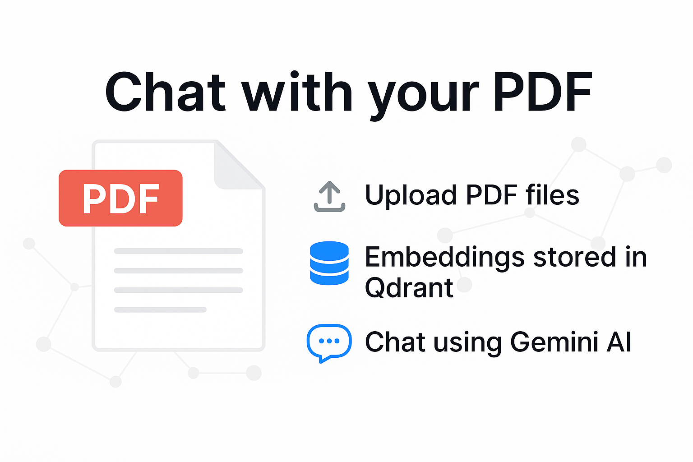

# PDF RAG (Retrieval-Augmented Generation) Application



1. Upload PDF files
2. Process and index the contents using embeddings stored in a Qdrant vector database
3. Chat with your PDF content using Google's Gemini AI

## Getting Started

### 1. Clone the repository

```bash
git clone <repository-url>
cd pdf_rag
```

### 2. Install dependencies

```bash
npm install
```

### 3. Set up environment variables

Update the `.env` file with your actual Gemini API key:

```
GEMINI_API_KEY=YOUR_GEMINI_API_KEY
QDRANT_URL=http://localhost:6333
PORT=3000
```

### 4. Start Qdrant database with Docker

```bash
docker-compose -f docker-compose.db.yml up -d
```

### 5. Run the development server

```bash
npm run dev
```

## API Endpoints

### Upload PDF

Upload a PDF file to be processed and indexed in the vector database.

- **Endpoint**: `POST /api/pdf/upload`
- **Content-Type**: `multipart/form-data`
- **Request Body**:
  - `pdf`: PDF file (max size: 10MB)
- **Response**:
  ```json
  {
    "message": "PDF processed successfully",
    "collectionName": "filename.pdf",
    "content": [...]
  }
  ```

### Chat with PDF

Send a query to chat with the content of a previously uploaded PDF.

- **Endpoint**: `POST /api/pdf/chat`
- **Content-Type**: `application/json`
- **Request Body**:
  ```json
  {
    "query": "What is the main topic of this document?",
    "collectionName": "filename.pdf"
  }
  ```
- **Response**:
  ```json
  {
    "message": "Chat completed successfully",
    "response": "The main topic of this document is..."
  }
  ```

## Project Structure

```
.
├── src/                  # Source code
│   ├── controller/       # API controllers
│   │   ├── chat.ts       # Chat controller
│   │   └── upload-pdf.ts # PDF upload controller
│   ├── middleware/       # Express middleware
│   │   └── multer-config.ts # File upload configuration
│   ├── router/           # API routes
│   │   ├── chat-router.ts # Chat routes
│   │   └── pdf-router.ts # PDF upload routes
│   └── server.ts         # Main server file
├── docker-compose.db.yml # Docker configuration for Qdrant
├── .env                  # Environment variables (create from .env.sample)
├── package.json          # Project metadata and dependencies
├── tsconfig.json         # TypeScript configuration
└── README.md             # Project documentation
```